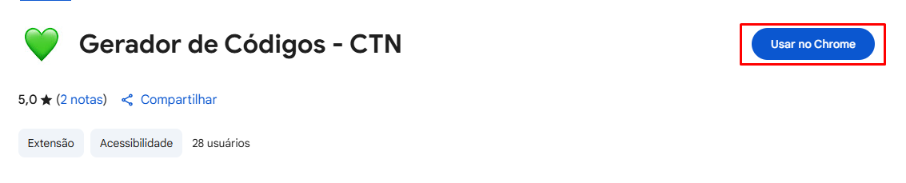
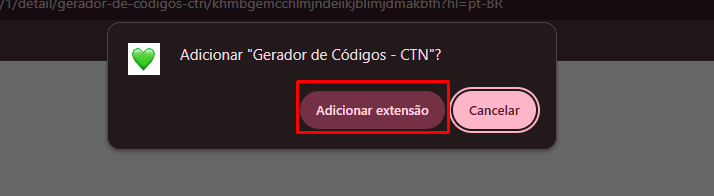
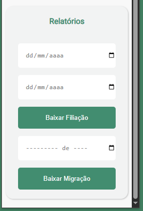

# 🚀 Gerador de Códigos – CTN

Uma extensão para Google Chrome criada para automatizar tarefas repetitivas dentro do sistema CTN, otimizando o fluxo de trabalho e reduzindo erros manuais no envio de documentações.

---

## ✨ Funcionalidades

- 🔍 **Busca automática de códigos** no sistema CTN e formatação no padrão correto.
- 🧹 **Limpeza de CPF**: remove pontos e traços de forma instantânea.
- 📊 **Geração de relatórios essenciais** para o dia a dia operacional.

> A extensão foi desenvolvida para uso interno, mas pode ser demonstrada sem necessidade de acesso ao sistema CTN.

---

## 📸 Demonstração

*⚠️ Como o sistema original é restrito, não é possível compartilhar uma demonstração pública. Caso deseje visualizar a lógica e estrutura, clone o projeto localmente.*

---


## 🧪 Como testar localmente

1. Baixe ou clone este repositório:

   ```bash
   git clone https://github.com/Danilo-Palacio/Gerador_de_codigos_CTN.git
   ```


## **⬇️** Como baixa-lo

[Baixe aqui a extensão na Chrome Web store](https://chromewebstore.google.com/u/1/detail/gerador-de-c%C3%B3digos-ctn/khmbgemcchlmjndeiikjblimjdmakbfh?hl=pt-BR)

1 - Clique em "Usar no Chrome



* 2 - Clique em adicionar extensão



3 - Clique no Ícone do coração


---

## Funções da extensão


* **1 - Gerador de Códigos**


> **Essa função não pode ser mostrada devido a utilizar funções do sistema principal*


* **2 - Correção de CPF**


Função bem simples, apenas para tirar os pontos e traços do CPF


* **3 - Download dos Relatórios**



Relatórios de Filiação no periodo selecionado, e das migrações.


---

### 🛠 Tecnologias

* JavaScript (puro)
* API de Extensões do Chrome
* HTML & CSS

---


## 🧠 Desafios Enfrentados

Este foi meu  **primeiro projeto de extensão para o Chrome** , o que me levou a estudar:

* A estrutura exigida pelo `manifest.json`
* A diferença entre scripts de background e content
* As permissões necessárias para interagir com páginas específicas
* O processo de publicação na [Chrome Web Store]()

---


## 📄 Licença

Este projeto foi desenvolvido para fins de estudo e uso pessoal/interno.

Licença: MIT
